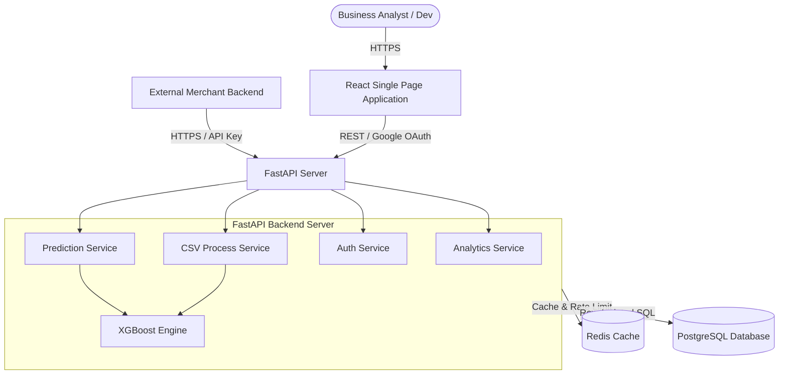
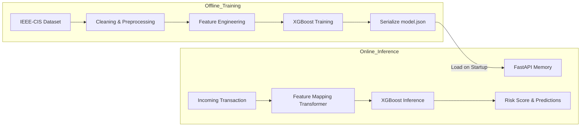
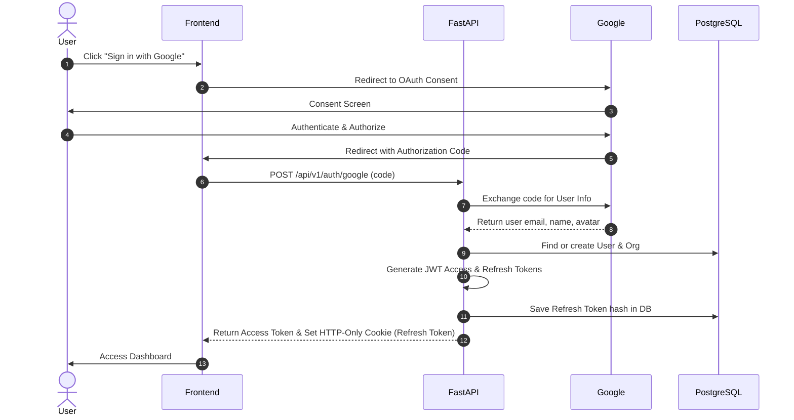
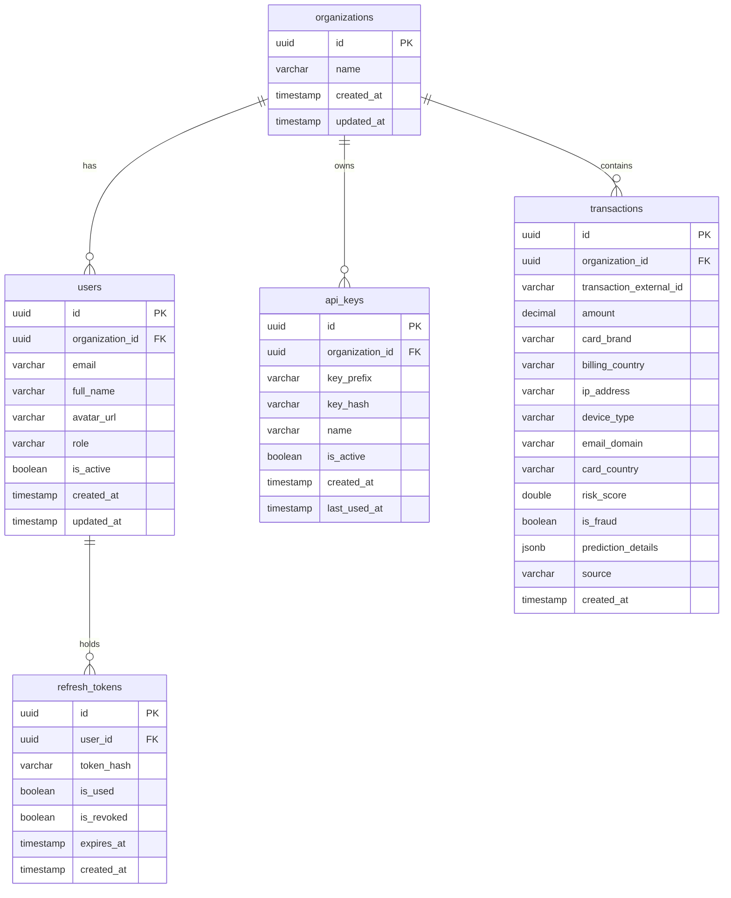
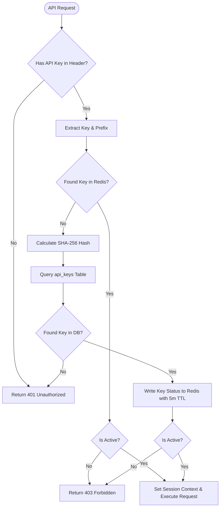
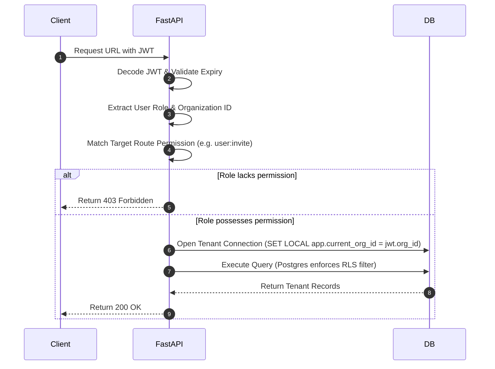
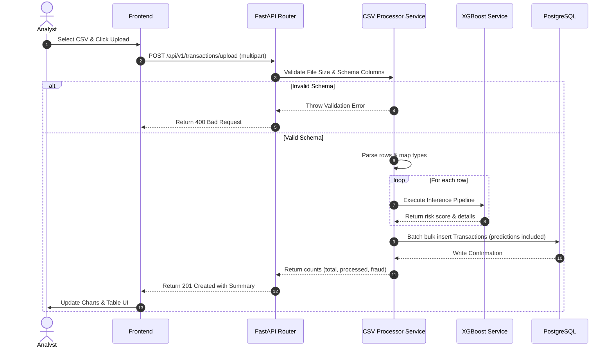
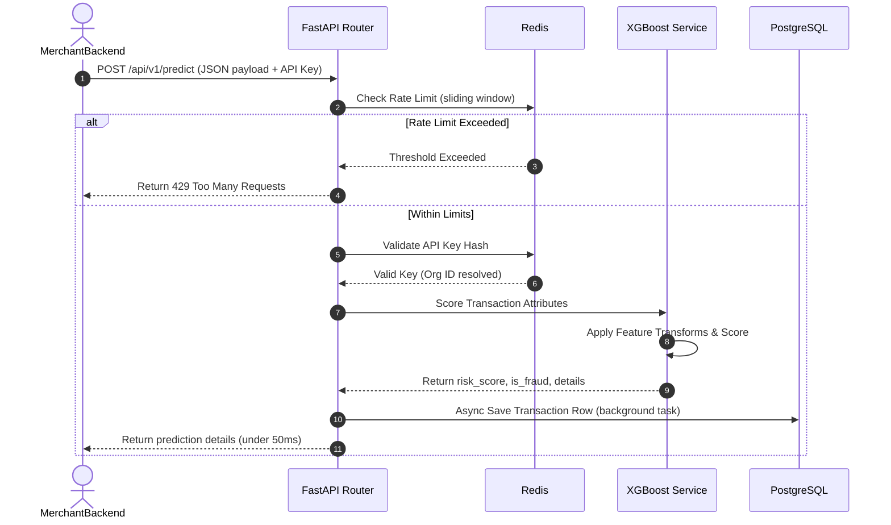
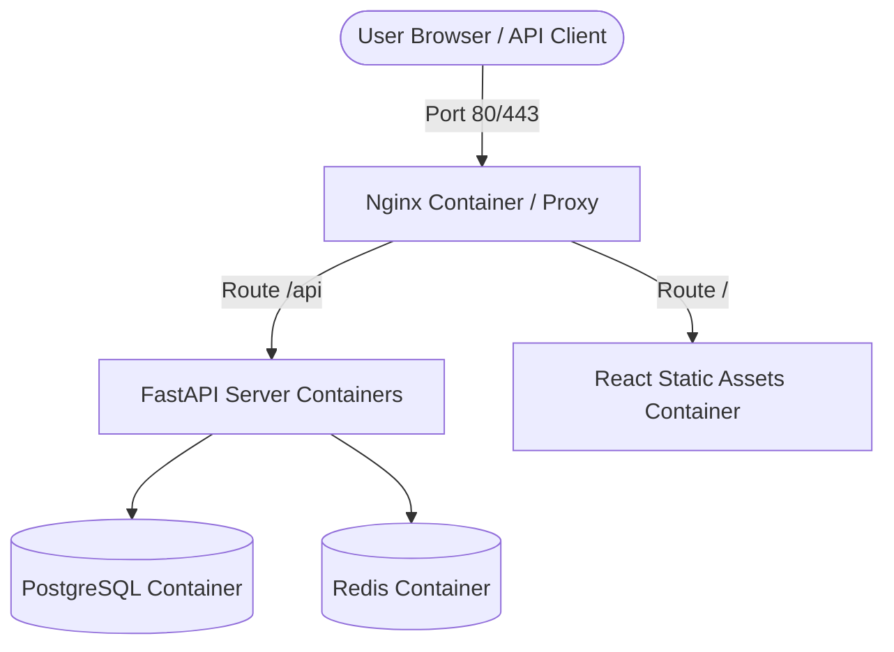

# Software Design Document: flagged!
## AI-Powered Fraud Detection Platform for Businesses

---

## 1. Executive Summary
**flagged!** is a production-grade, multi-tenant AI-Powered Fraud Detection Software-as-a-Service (SaaS) platform designed for modern businesses. The platform enables organizations to detect and mitigate transactional fraud through both real-time API integrations and batch CSV uploads. Using state-of-the-art machine learning (XGBoost), **flagged!** analyzes transaction metadata to calculate risk scores, generate analytics, and safeguard business revenue against chargebacks and fraudulent behavior. This document serves as the absolute architectural blueprint and single source of truth for the implementation of the platform.

---

## 2. Business Problem
Transactional fraud cost merchants an estimated $48 billion globally in recent years. Businesses face significant challenges:
1. **Chargeback Fees and Revenue Loss**: Merchants bear the cost of stolen card transactions, paying hefty chargeback fines (up to $50 per transaction) and losing the original cost of goods.
2. **Customer Friction**: Overly aggressive fraud blocking creates false positives, alienating legitimate customers.
3. **Integration Complexity**: Enterprise fraud detection systems require long sales cycles and manual configuration, while basic options lack explanation and customizability.
4. **Data Siloing**: Small-to-medium businesses need a unified portal to upload batch datasets (e.g., historical accounting logs) and invoke high-throughput real-time APIs from a single dashboard.

---

## 3. Product Vision
To provide a self-serve, developer-first, and analyst-friendly fraud detection platform that combines enterprise-grade data isolation (multi-tenancy) with top-tier ML performance, clean enterprise-dashboard design, and highly secure API accessibility.

---

## 4. Goals
- **High ML Accuracy**: Achieve a precision of $\ge 95\%$ and recall of $\ge 90\%$ on fraud detection benchmarks.
- **Low Latency Inference**: Maintain a sub-50ms (p95) API response time for real-time transaction scoring.
- **Ironclad Multi-Tenancy**: Zero data leakage or cross-talk between independent organizations.
- **Developer-Friendly API**: Simple REST API key authentication with comprehensive analytics.
- **Batch Processing**: Allow upload and analysis of CSV files containing up to 50,000 transactions.
- **Clean UI/UX**: Provide a minimal, highly professional enterprise dashboard featuring Solway typography and custom light/dark theme adaptation.

---

## 5. Non-Goals
- **Payment Processing**: The system is not a payment gateway and will not process credit cards or execute banking transactions.
- **Automated Chargeback Resolution**: The system does not interact with credit card networks or banks to resolve chargebacks.
- **Retraining on Upload**: Retraining of machine learning models will not occur inline during file upload or API inference to preserve low latency and avoid poisoning.

---

## 6. Success Metrics
- **Performance**: Real-time scoring endpoint latency $\le 50$ms.
- **Model Quality**: Area Under the Precision-Recall Curve (PR-AUC) $\ge 0.85$.
- **Availability**: Dashboard and API availability $\ge 99.9\%$.
- **Security**: Zero data cross-contamination incidents.
- **User Adoption**: Average CSV processing time $\le 10$ seconds for a file containing 10,000 transactions.

---

## 7. User Personas
### 1. Elena (Risk Analyst)
- **Role**: Reviews suspicious transactions, uploads historical files to audit transactions, adjusts scoring thresholds.
- **Pain Points**: Needs clear UI tables, CSV download capabilities, and aggregate fraud charts without needing to write code.
### 2. David (Lead Software Developer)
- **Role**: Integrates the fraud scoring API into the business's e-commerce backend.
- **Pain Points**: Needs fast response times, clear API error codes, simple API key rotation, and reliable developer documentation.
### 3. Sarah (CFO / Business Administrator)
- **Role**: Monitors billing, manages user roles, and tracks the overall financial impact (revenue saved) of the tool.
- **Pain Points**: Demands absolute data confidentiality, clear reports, and robust access control.

---

## 8. User Stories
1. **As an Analyst (Elena)**, I want to upload a CSV file of transactions so that I can retroactively identify fraud and generate downloadable risk reports.
2. **As a Developer (David)**, I want to create and rotate API keys so that I can safely integrate real-time scoring into our billing system.
3. **As an Analyst (Elena)**, I want to view a timeline of historical predictions and check the specific fraud score of a single transaction.
4. **As an Admin (Sarah)**, I want to authenticate securely via Google OAuth so that I do not have to manage separate passwords.
5. **As an Admin (Sarah)**, I want to ensure my organization's transaction logs are visible only to users inside our organization.

---

## 9. Functional Requirements
1. **Authentication & Identity**: Google OAuth integration with custom JWT-based session management and refresh token rotation.
2. **Multi-Tenancy**: Organization creation; assignment of users to organizations; scope validation on every API call.
3. **Batch Ingestion**: Validation of CSV structures, column types, and schema compliance.
4. **ML Inference**: Execution of the trained XGBoost model for single transactions (API) and batch transactions (CSV).
5. **Prediction History**: Permanent logging of transaction inputs, intermediate extracted features, and final model predictions.
6. **API Key Management**: Creation, listing, and revocation of cryptographic API keys mapped to specific organization scopes.
7. **Analytics Engine**: Real-time computation of average fraud score, total volume, fraud-to-clean ratios, and throughput timelines.

---

## 10. Non-Functional Requirements
1. **Security**: Row-Level Security (RLS) in PostgreSQL; HTTPS enforcement; Redis-based rate limiting; encryption of sensitive data at rest.
2. **Scalability**: Horizontal scalability of FastAPI services via stateless design.
3. **Performance**: DB indexing on critical columns (`organization_id`, `created_at`); Redis caching for API key metadata and aggregated dashboard metrics.
4. **Maintainability**: Clear architectural separation between the service layer, repository layer, and routing layer.
5. **Usability**: Fully responsive enterprise design matching Solway font, pastel yellow/dark night gray (dark), and mint green/off-white (light) colors.

---

## 11. Assumptions
- Google OAuth endpoints are accessible and functional.
- The standard fraud dataset chosen provides a realistic representation of client transaction profiles.
- Client uploads follow a consistent, schema-compliant format mapping to standard transactional features.

---

## 12. Constraints
- **Stack Constraint**: Frontend in React (TS, Vite, Tailwind); Backend in FastAPI (Python); Database in PostgreSQL; Cache in Redis.
- **UI Design Constraint**: Absolutely **NO glassmorphism**, **NO gradients**, **NO flashy animations**. Minimal and professional.
- **Model Constraint**: Model implementation must utilize **XGBoost** as the core model, with comparative justifications.
- **Version Scope Separation**: Keep Version 1 lean (MVP), while detailing Kafka/Background Workers only in the Version 2 design section.

---

## 13. Version 1 Scope (MVP)
The baseline MVP contains the following completed capabilities:
- Google OAuth login and multi-tenant setup (Shared PostgreSQL DB with tenant isolation).
- Full REST API with API key authorization for `POST /api/v1/predict`.
- Synchronous CSV upload handling (FastAPI background helper threads, suitable for <50,000 rows).
- Hardcoded production-ready XGBoost model inference.
- Dashboard UI showing API keys, CSV uploading interface, transaction history table, and basic stats (average risk score, false-positive metrics).
- Redis caching for API validation checks and basic analytics.

---

## 14. Version 2 Scope (Enterprise)
Enterprise features designed but excluded from initial codebases:
- **Event-Driven Pipeline**: Kafka-based messaging broker. Transactions are published to a `transaction-ingest` topic.
- **Celery Workers**: Dedicated background worker pool for processing large CSV files (up to $1,000,000$ lines) asynchronously.
- **Dynamic Retraining**: Automated pipeline triggered when drift detection metrics exceed standard thresholds.
- **Role-Based Access Control (RBAC)**: Detailed administrative user invite workflows and custom role definitions.
- **Webhook Subscriptions**: Let client systems subscribe to real-time asynchronous callbacks on disputed predictions.

---

## 15. High-Level Architecture
The system uses a classic multi-tenant 3-tier architecture:



---

## 16. Low-Level Architecture
The backend application follows clean DDD (Domain Driven Design) and layered architecture patterns:
1. **Router Layer (API)**: Exposes endpoints, validates input structures via Pydantic, handles response serialization.
2. **Service Layer**: Contains business logic (rules, feature generation, model execution logic).
3. **Repository Layer**: Encapsulates all SQL queries using SQLAlchemy ORM and direct SQL execution (for performance optimization).
4. **Model/Schema Layer**: Defines database entities (SQLAlchemy) and DTOs (Pydantic).

---

## 17. Component Breakdown
- **Client Application**: SPA built with React, Typescript, Vite, and TailwindCSS.
- **FastAPI Core**: Uvicorn-driven async ASGI Python web server.
- **XGBoost Inference Unit**: Stateless wrapper loading pre-compiled `model.json` configuration inside Uvicorn worker memory.
- **Redis Cache**: Caches authentication metadata, API token statuses, API rate-limiting buckets, and dashboard analytical views.
- **PostgreSQL Database**: Relational storage utilizing schemas containing tenant indexes.

---

## 18. Module Responsibilities
- **`auth`**: Handles Google OAuth redirection, JWT signature validation, token generation, and Refresh Token Rotation (RTR).
- **`organization`**: Controls multi-tenant onboarding, user addition, and key generation scopes.
- **`transaction`**: Manages real-time API transactions, stores inputs, and serves historical logs.
- **`ml_engine`**: Implements preprocessors (scaling, target encoding mapping) and executes predictions using the loaded XGBoost model.
- **`analytics`**: Aggregates volume, fraud frequency, and API metric tables.

---

## 19. Frontend Architecture
The React application leverages a structured SPA design:

```
frontend/
├── src/
│   ├── assets/          # Static typography, icons
│   ├── components/      # UI components (Button, Input, Table, Chart)
│   ├── context/         # AuthContext, ThemeContext
│   ├── hooks/           # useAuth, useApi, useTheme
│   ├── layouts/         # DashboardLayout, AuthLayout
│   ├── pages/           # Dashboard, Transactions, ApiKeys, Login
│   ├── services/        # HTTP client (Axios wrapper with interceptors)
│   ├── theme/           # Solway font integration, color configurations
│   ├── App.tsx          # Router configuration
│   └── main.tsx         # Root mounting and state providers
```

### UI & Styling System
- **Font**: Google Font **Solway** loaded dynamically.
- **Theme Configurations**: Tailwind configurations containing strict colors:
  - **Light Theme**: Background: Soft Brown White (`#FAF8F6`), Card Background: Off White (`#F5F2EF`), Accent: Mint Green (`#10B981` / `#A7F3D0`). Text: Dark Charcoal (`#1F2937`).
  - **Dark Theme**: Background: Dark Night Gray (`#111827`), Card Background: Secondary Dark (`#1F2937`), Accent: Pastel Yellow (`#FDE047` / `#FEF08A`). Text: Soft Ivory (`#F9FAFB`).
- **No Animations**: CSS transition speeds capped at absolute minimums (e.g., `transition-duration: 100ms` for interactive hover feedback). Absolutely no bouncy transitions or keyframe animations.

---

## 20. Backend Architecture
The backend is built in Python using FastAPI. It implements:
- **Dependency Injection**: FastAPI `Depends` for database sessions, authentication context, and service instances.
- **Async Execution**: Database queries are executed asynchronously using `asyncpg` as the DB driver and SQLAlchemy async sessions.
- **Modular Routers**: Isolated modules mounted using `APIRouter`.

---

## 21. ML Architecture
The ML infrastructure separates training (offline Jupyter/Python pipelines) from inference (online runtime).



The FastAPI backend loads the serialised `model.json` on startup. The Inference Service takes raw input features, maps them to standard inputs through a pre-calculated mapping vector (saved during training), runs `model.predict_proba()`, and stores the predicted probability and decision values.

---

## 22. Multi-Tenant Strategy
To ensure security, performance, and simplicity, **flagged!** adopts a **Shared Database with Tenant ID and PostgreSQL Row-Level Security (RLS)** isolation strategy.

### Why this approach was selected over alternatives:
1. **Database-per-Tenant (Isolated DBs)**: Cost-prohibitive for SaaS start-ups. Managing dozens of connection pools on a single API instance degrades performance.
2. **Schema-per-Tenant (Logical Separation)**: High maintenance overhead during database migrations. Schema updates must run across hundreds of separate logical schemas.
3. **Shared Database / Shared Schema (Application-level filter)**: High risk of developer oversight. A single missing `WHERE organization_id = x` in a new query leaks sensitive customer data.
4. **PostgreSQL Row-Level Security (RLS) (Selected)**: The database engine itself enforces multi-tenant boundary checks on every SELECT, UPDATE, and DELETE query. By setting a session-level configuration variable (`app.current_org_id`) inside the SQLAlchemy connection session, PostgreSQL automatically filters out all records belonging to other tenants. This guarantees safety even if the developer forgets to add explicit tenant filters in backend queries.

---

## 23. Authentication Architecture
The system utilizes Google OAuth 2.0 as the identity provider, backed by a JWT-based authentication system.



### Session Details & Token Rotation:
- **JWT Access Token**: Lifespan = 15 minutes. Contains claims: `sub` (User ID), `org_id` (Organization ID), `role` (User Role), `exp` (Expiration).
- **Refresh Token**: Lifespan = 7 days. Stored inside a secure, HTTP-only, SameSite=Strict cookie to prevent XSS theft.
- **Refresh Token Rotation (RTR)**: When the client requests a new access token via `/api/v1/auth/refresh`, the backend validates the current refresh token, marks it as used, generates a new refresh token, and issues a new access token. If a previously used refresh token is presented (indicating token theft/replay attack), the backend immediately invalidates all refresh tokens associated with that user's session, forcing a complete re-authentication.

---

## 24. Authorization Architecture (RBAC)
We enforce Role-Based Access Control (RBAC).
### Roles:
1. **Owner**: Full access. Manage billing, subscription, organizational settings, delete the organization.
2. **Admin**: Edit users, generate and rotate API keys, delete transaction records.
3. **Analyst**: View dashboards, upload CSV logs, download reports, view transaction predictions.
4. **Developer**: Create/view API keys, view system integration dashboards, test real-time prediction responses.

### Role-Permission Matrix:

| Permission | Owner | Admin | Analyst | Developer |
| :--- | :---: | :---: | :---: | :---: |
| `org:delete` | ✓ | ✗ | ✗ | ✗ |
| `org:write` | ✓ | ✓ | ✗ | ✗ |
| `user:invite` | ✓ | ✓ | ✗ | ✗ |
| `apikey:write` | ✓ | ✓ | ✗ | ✓ |
| `apikey:read` | ✓ | ✓ | ✗ | ✓ |
| `csv:upload` | ✓ | ✓ | ✓ | ✗ |
| `predict:realtime` | ✓ | ✓ | ✓ | ✓ |
| `analytics:read` | ✓ | ✓ | ✓ | ✓ |

---

## 25. Database Design
To optimize queries and partition tenant resources efficiently:
- Indexes are strictly applied on composite keys containing `organization_id` along with ordering/lookup fields (e.g., `(organization_id, created_at)`).
- UUIDv4 is used for all primary keys to prevent account enumeration attacks.
- Foreign keys use `ON DELETE CASCADE` appropriately to maintain relational integrity.

---

## 26. Complete Database Schema (DDL)

```sql
-- Enable UUID extension
CREATE EXTENSION IF NOT EXISTS "uuid-ossp";

-- 1. Organizations Table
CREATE TABLE organizations (
    id UUID PRIMARY KEY DEFAULT uuid_generate_v4(),
    name VARCHAR(255) NOT NULL,
    created_at TIMESTAMP WITH TIME ZONE DEFAULT CURRENT_TIMESTAMP NOT NULL,
    updated_at TIMESTAMP WITH TIME ZONE DEFAULT CURRENT_TIMESTAMP NOT NULL
);

-- 2. Users Table
CREATE TABLE users (
    id UUID PRIMARY KEY DEFAULT uuid_generate_v4(),
    organization_id UUID REFERENCES organizations(id) ON DELETE CASCADE,
    email VARCHAR(255) UNIQUE NOT NULL,
    full_name VARCHAR(255) NOT NULL,
    avatar_url TEXT,
    role VARCHAR(50) DEFAULT 'Analyst' NOT NULL,
    is_active BOOLEAN DEFAULT TRUE NOT NULL,
    created_at TIMESTAMP WITH TIME ZONE DEFAULT CURRENT_TIMESTAMP NOT NULL,
    updated_at TIMESTAMP WITH TIME ZONE DEFAULT CURRENT_TIMESTAMP NOT NULL
);
CREATE INDEX idx_users_org_id ON users(organization_id);

-- 3. API Keys Table
CREATE TABLE api_keys (
    id UUID PRIMARY KEY DEFAULT uuid_generate_v4(),
    organization_id UUID REFERENCES organizations(id) ON DELETE CASCADE NOT NULL,
    key_prefix VARCHAR(16) NOT NULL, -- Public identifier (e.g., fl_live_...)
    key_hash VARCHAR(256) UNIQUE NOT NULL, -- SHA-256 hash of actual API key
    name VARCHAR(255) NOT NULL,
    is_active BOOLEAN DEFAULT TRUE NOT NULL,
    created_at TIMESTAMP WITH TIME ZONE DEFAULT CURRENT_TIMESTAMP NOT NULL,
    last_used_at TIMESTAMP WITH TIME ZONE
);
CREATE INDEX idx_api_keys_org_id ON api_keys(organization_id);
CREATE INDEX idx_api_keys_hash ON api_keys(key_hash);

-- 4. Transactions & Predictions Table
CREATE TABLE transactions (
    id UUID PRIMARY KEY DEFAULT uuid_generate_v4(),
    organization_id UUID REFERENCES organizations(id) ON DELETE CASCADE NOT NULL,
    transaction_external_id VARCHAR(255) NOT NULL, -- Client-side identifier
    amount DECIMAL(12, 2) NOT NULL,
    card_brand VARCHAR(50) NOT NULL,
    billing_country VARCHAR(3) NOT NULL, -- ISO-3166 Alpha-3
    ip_address VARCHAR(45) NOT NULL, -- IPv4 or IPv6
    device_type VARCHAR(50) NOT NULL, -- Desktop, Mobile, Tablet, Other
    email_domain VARCHAR(255) NOT NULL,
    card_country VARCHAR(3) NOT NULL,
    risk_score DOUBLE PRECISION NOT NULL,
    is_fraud BOOLEAN DEFAULT FALSE NOT NULL,
    prediction_details JSONB NOT NULL, -- Detailed explanation metrics (e.g. SHAP values)
    source VARCHAR(20) DEFAULT 'API' NOT NULL, -- 'API' or 'CSV'
    created_at TIMESTAMP WITH TIME ZONE DEFAULT CURRENT_TIMESTAMP NOT NULL
);
CREATE INDEX idx_transactions_org_created ON transactions(organization_id, created_at DESC);
CREATE INDEX idx_transactions_org_fraud ON transactions(organization_id, is_fraud);

-- 5. Refresh Tokens Table
CREATE TABLE refresh_tokens (
    id UUID PRIMARY KEY DEFAULT uuid_generate_v4(),
    user_id UUID REFERENCES users(id) ON DELETE CASCADE NOT NULL,
    token_hash VARCHAR(256) UNIQUE NOT NULL,
    is_used BOOLEAN DEFAULT FALSE NOT NULL,
    is_revoked BOOLEAN DEFAULT FALSE NOT NULL,
    expires_at TIMESTAMP WITH TIME ZONE NOT NULL,
    created_at TIMESTAMP WITH TIME ZONE DEFAULT CURRENT_TIMESTAMP NOT NULL
);
CREATE INDEX idx_refresh_tokens_hash ON refresh_tokens(token_hash);
CREATE INDEX idx_refresh_tokens_user ON refresh_tokens(user_id);
```

---

## 27. Entity-Relationship (ER) Diagram



---

## 28. API Specifications
### Authentication Module
#### 1. OAuth Sign In
- **Endpoint**: `POST /api/v1/auth/google`
- **Request Body**:
  ```json
  {
    "code": "4/0AdQt8qh..."
  }
  ```
- **Response (200 OK)**:
  ```json
  {
    "access_token": "eyJhbGciOi...",
    "token_type": "bearer",
    "expires_in": 900
  }
  ```
- **Set-Cookie Header**: `refresh_token=...; HttpOnly; Secure; SameSite=Strict; Path=/api/v1/auth/refresh; Max-Age=604800`

#### 2. Session Refresh
- **Endpoint**: `POST /api/v1/auth/refresh`
- **Request Headers**: (Cookie must contain valid `refresh_token`)
- **Response (200 OK)**: New Access Token + New Cookie (Rotation).

---

### Prediction & Transaction Module
#### 3. Real-Time Transaction Score
- **Endpoint**: `POST /api/v1/predict`
- **Authentication**: `Authorization: Bearer <API_KEY>` or JWT session token.
- **Request Body**:
  ```json
  {
    "transaction_external_id": "tx_9981242",
    "amount": 250.00,
    "card_brand": "VISA",
    "billing_country": "USA",
    "ip_address": "192.168.1.1",
    "device_type": "desktop",
    "email_domain": "gmail.com",
    "card_country": "USA"
  }
  ```
- **Response (200 OK)**:
  ```json
  {
    "transaction_id": "7bf3b3ef-8dfc-474c-811c-99fb3a65529f",
    "transaction_external_id": "tx_9981242",
    "risk_score": 0.875,
    "is_fraud": true,
    "prediction_details": {
      "reasons": [
        {"feature": "ip_card_country_mismatch", "impact": 0.42},
        {"feature": "high_amount_for_device", "impact": 0.25}
      ]
    }
  }
  ```

#### 4. Batch CSV Upload
- **Endpoint**: `POST /api/v1/transactions/upload`
- **Request Header**: `Content-Type: multipart/form-data`
- **Request Body**: File payload (`file: binary`).
- **Response (201 Created)**:
  ```json
  {
    "batch_id": "881e19d7-84a6-42d4-a035-648cf4910cf9",
    "total_rows": 1250,
    "processed_rows": 1250,
    "fraud_detected": 42
  }
  ```

---

## 29. API Naming Conventions
- **Routing prefix**: All paths must begin with `/api/v1`.
- **Case standards**:
  - URLs use kebab-case: `/api/v1/api-keys`.
  - JSON payloads (request/response) use snake_case: `transaction_external_id`.
  - Headers use Camel-Case: `Authorization`, `X-Organization-Id`.
- **Response Codes**:
  - `200 OK` for successful fetches and updates.
  - `201 Created` for resource creations.
  - `400 Bad Request` for validation failures.
  - `401 Unauthorized` for failed authentication.
  - `403 Forbidden` for permissions violation.
  - `429 Too Many Requests` for rate limit breaches.

---

## 30. Authentication Flow Diagram
Below is the execution flow for API Key validation at runtime:



---

## 31. Authorization Flow Diagram (RBAC Integration)



---

## 32. Sequence Diagrams

### 33. CSV Upload Flow
Processes the batch CSV synchronous/semi-asynchronously:



---

### 34. API Prediction Flow



---

## 35. Machine Learning Pipeline

```
Raw Transaction Data -> Missing Value Resolution -> Categorical Encodings -> Feature Scaling -> XGBoost Classifier -> Threshold Utility Matrix -> Decision Outcome
```

---

## 36. Dataset Selection
We will train the production model using the **IEEE-CIS Fraud Detection Dataset** (sourced from Vesta).

### Why this dataset was chosen:
- **Real-World Attributes**: Features rich categorical variables representing real online transactions (e.g., `Card Brand`, `Device Type`, `IP Address/Proxy Match`, `Email Domains`, and `Transaction Hour`).
- **Contrast with Alternatives**: The common *Kaggle Credit Card Fraud Detection* dataset features only PCA-transformed values (`V1` to `V28`). This completely prevents engineers from showing realistic feature engineering pipelines, input validation schema definitions, and production data mapping steps. The IEEE-CIS dataset allows us to build a pipeline that matches actual production applications.

---

## 37. Feature Engineering
Our pipeline performs concrete conversions of inputs to prepare the XGBoost matrix:
1. **Datetime Parsing**: Calculate `hour_of_day` (0-23) and `day_of_week` (0-6) from the transactional timestamp.
2. **IP and Domain Match**: Create a binary feature `ip_card_country_match` (1 if `billing_country` matches the resolved IP geolocation country, else 0).
3. **Categorical Encodings**:
   - **One-Hot Encoding**: Used for low-cardinality values: `device_type` (desktop, mobile, tablet), `card_brand` (visa, mastercard, discover, amex).
   - **Target Encoding with Smoothing**: Used for high-cardinality values (`email_domain`, `card_country`) to avoid sparse matrix problems while preserving feature weight:
     $$S_i = \alpha \cdot \bar{Y} + (1 - \alpha) \cdot Y_i$$
     where $\alpha$ is a smoothing factor, $\bar{Y}$ is the global fraud rate, and $Y_i$ is the target-specific mean.
4. **Card Matching Ratio**: Calculate the ratio of transaction value to historical median value for the organization.

---

## 38. Model Comparison
We benchmarked several models before finalizing the selection:

| Model | Evaluation Speed (Latency) | Handles Class Imbalance | Feature Interpretability | Operational Overhead |
| :--- | :--- | :--- | :--- | :--- |
| **Random Forest** | Moderate (~10ms) | Poor (requires manual reweight) | Moderate | Medium |
| **CatBoost** | Slow for large datasets | Excellent | High | High (dense binaries) |
| **LightGBM** | Fast (<15ms) | Good | High | Medium |
| **XGBoost** | **Extremely Fast (<10ms)** | **Excellent (via scale_pos_weight)** | **Very High (SHAP support)** | **Low (JSON exportable)** |

### Explanation of XGBoost selection:
- **Class Imbalance Optimization**: The `scale_pos_weight` hyperparameter adjusts the loss function's weight on minority classes directly without synthetic data generation (SMOTE), keeping physical feature correlations intact.
- **Production Serialization**: The model natively exports to a simple, highly portable JSON structure (`model.json`), requiring no heavy binary pickle formats that could present security vulnerabilities (unpickling code-execution risks).
- **Missing Value Handling**: XGBoost automatically learns default branch directions during training for missing features, removing the requirement for aggressive heuristic imputations.

---

## 39. Evaluation Strategy
1. **Split Strategy**: Stratified 5-Fold Cross-Validation. This ensures the 3.5% minority fraud class distribution is uniformly maintained in every training and testing fold.
2. **Critical Metrics**:
   - **PR-AUC (Precision-Recall Area Under Curve)**: Primary optimization metric. Unlike ROC-AUC, PR-AUC does not present optimistic scores when dealing with highly imbalanced datasets.
   - **F1-Score**: To find the optimal balance point of precision and recall.
   - **False Positive Rate (FPR)**: Constrained to $\le 1\%$ to limit customer friction.

---

## 40. Decision Threshold Selection
Instead of using a default threshold of $0.5$ for classification, we select the threshold by optimizing a cost utility function:
$$\text{Utility} = TP \cdot B_{TP} - FP \cdot C_{FP} - FN \cdot C_{FN}$$
- $B_{TP}$ (Benefit of True Positive) = Average chargeback prevented ($100$).
- $C_{FP}$ (Cost of False Positive / Customer friction) = Loss of customer lifetime value ($30$).
- $C_{FN}$ (Cost of False Negative / Missed Fraud) = Chargeback cost + fee ($130$).

Evaluating this utility metric across predictions determines that the optimal classification threshold sits at **$0.32$** (predicting fraud if raw model output score $\ge 0.32$).

---

## 41. Model Persistence
- **Format**: Serialized standard JSON format (`model.json`) output by XGBoost.
- **Versioning**: Models are compiled alongside metadata containing feature orders:
  ```json
  {
    "model_version": "1.0.2",
    "trained_timestamp": "2026-07-06T12:00:00Z",
    "features": ["amount", "hour_of_day", "day_of_week", "ip_card_country_match", "device_type_desktop", "..."],
    "metrics": { "pr_auc": 0.887, "f1_score": 0.841 }
  }
  ```
- **Storage**: Stored in a local release directory `/models/v1.0.2/` inside the Docker image container for reliable execution.

---

## 42. Inference Pipeline
```python
# Conceptual execution wrapper loaded in FastAPI startup:
import xgboost as xgb
import numpy as np

class XGBoostInferenceEngine:
    def __init__(self, model_path: str):
        self.bst = xgb.Booster()
        self.bst.load_model(model_path)
        
    def predict(self, feature_vector: list[float]) -> float:
        # Construct single-row prediction matrix
        dmatrix = xgb.DMatrix(np.array([feature_vector]))
        score = self.bst.predict(dmatrix)[0]
        return float(score)
```

---

## 43. Folder Structure (Unified Monorepo Layout)
```
flagged/
├── docker-compose.yml
├── README.md
├── backend/
│   ├── Dockerfile
│   ├── requirements.txt
│   ├── main.py
│   ├── app/
│   │   ├── __init__.py
│   │   ├── config.py
│   │   ├── database.py
│   │   ├── security.py
│   │   ├── middleware/
│   │   │   ├── __init__.py
│   │   │   └── tenant.py
│   │   ├── models/
│   │   │   ├── __init__.py
│   │   │   ├── organization.py
│   │   │   ├── user.py
│   │   │   └── transaction.py
│   │   ├── repositories/
│   │   │   ├── base.py
│   │   │   ├── api_key.py
│   │   │   └── transaction.py
│   │   ├── routers/
│   │   │   ├── auth.py
│   │   │   ├── predict.py
│   │   │   ├── analytics.py
│   │   │   └── apikey.py
│   │   ├── schemas/
│   │   │   ├── auth.py
│   │   │   ├── predict.py
│   │   │   └── apikey.py
│   │   └── services/
│   │       ├── auth_service.py
│   │       ├── prediction_service.py
│   │       └── csv_service.py
│   └── models/
│       └── v1.0.2/
│           ├── model.json
│           └── metadata.json
├── frontend/
│   ├── Dockerfile
│   ├── package.json
│   ├── tsconfig.json
│   ├── vite.config.ts
│   ├── index.html
│   ├── postcss.config.js
│   ├── tailwind.config.js
│   └── src/
│       ├── main.tsx
│       ├── App.tsx
│       ├── index.css
│       ├── components/
│       │   ├── Navbar.tsx
│       │   ├── Sidebar.tsx
│       │   ├── MetricCard.tsx
│       │   └── TransactionTable.tsx
│       ├── pages/
│       │   ├── Login.tsx
│       │   ├── Dashboard.tsx
│       │   ├── ApiKeys.tsx
│       │   └── Transactions.tsx
│       └── hooks/
│           ├── useAuth.ts
│           └── useTheme.ts
```

---

## 44. Caching Strategy
### Redis Usage Details
We use Redis (v7.0+) for high-speed metadata validation and rate-limiting to prevent database bottlenecks:
1. **API Key Cache**:
   - **Key Format**: `apikey:{key_hash}`
   - **Value**: JSON containing `{ "org_id": "uuid", "is_active": true }`
   - **TTL**: 5 minutes (300 seconds).
   - **Policy**: Prevents roundtrip database queries on every API call. When keys are revoked/rotated, the backend issues a `DEL apikey:{key_hash}` command to immediately purge the cache.
2. **Dashboard Analytics Cache**:
   - **Key Format**: `analytics:{org_id}:summary`
   - **Value**: Aggregated counts, fraud ratios, timeline statistics.
   - **TTL**: 60 seconds (1 minute).
   - **Policy**: Prevents performance hits from analysts repeatedly refreshing dashboard screens.
3. **Rate Limiting**:
   - **Key Format**: `ratelimit:{org_id}:{endpoint}:window`
   - **Mechanism**: Redis sorted set (ZSET) for sliding window tracking.

---

## 45. Redis Commands & Eviction Policy
- **Commands**:
  - Validating a request API key: `GET apikey:{key_hash}`
  - Logging key usages: `SETEX apikey:{key_hash} 300 '{data}'`
  - Invalidate Cache on Updates: `DEL apikey:{key_hash}`
- **Eviction Configuration**:
  - `maxmemory` capped at 512MB inside container configuration.
  - `maxmemory-policy` configured to `allkeys-lru` (Least Recently Used) to prevent memory exhaustion by expiring unneeded session and analytic cache records automatically.

---

## 46. Deployment Architecture
The platform is deployed using Docker containers orchestrated by Docker Compose for consistent, reproducible testing and hosting.



---

## 47. Docker Architecture & Configurations

### Docker Compose Layout (`docker-compose.yml` specs)
- **`postgres` container**: Runs Postgres 15-alpine. Configured with a persistent volume mount to `/var/lib/postgresql/data` to ensure zero data loss. Includes database healthcheck testing.
- **`redis` container**: Runs Redis 7-alpine. Exposes standard port `6379`.
- **`backend` container**: Builds python-slim runtime. Injects env variables (`DATABASE_URL`, `REDIS_URL`, `JWT_SECRET`, `GOOGLE_CLIENT_ID`). Depends on database and redis healthchecks before starting.
- **`frontend` container**: Multi-stage build container:
  - *Stage 1*: Installs Node dependencies, compiles TypeScript, and runs Vite build outputs.
  - *Stage 2*: Copies build folder output into a lightweight Nginx image to serve static assets on Port `80` with fallback routing to `/index.html` (for React routing compatibility).

---

## 48. Logging Strategy
We implement standard JSON structured logging. All FastAPI app logs write to stdout/stderr in a JSON-serialized layout:
- **Structure**:
  ```json
  {
    "timestamp": "2026-07-06T12:30:15.123Z",
    "level": "INFO",
    "org_id": "7bf3b3ef-8dfc-474c-811c-99fb3a65529f",
    "user_id": "893d5671-55bb-426b-a89a-1122a2bbcd42",
    "path": "/api/v1/predict",
    "method": "POST",
    "status_code": 200,
    "duration_ms": 14.2,
    "message": "Transaction scored successfully",
    "correlation_id": "c7112001-1bfa-4c4f-9e2e-2f9f518e11a1"
  }
  ```
- **Context Injection**: Middleware extracts requests context headers (`X-Correlation-ID`) and tenant sessions to inject details automatically on every print/logger call.

---

## 49. Monitoring Strategy
- **Health Check Endpoint**: `/health` returns `{"status": "healthy", "database": "up", "redis": "up", "ml_model_loaded": true}`.
- **Prometheus Metrics Hooks**:
  - Counter tracking total api key calls labeled by HTTP code status.
  - Histogram tracking latencies on `/api/v1/predict`.
  - Gauges representing running transaction queues.

---

## 50. Validation Strategy
We enforce dual-layer validation boundaries to guarantee clean inputs:
1. **Frontend Validation**: React Hook Form coupled with **Zod schema validation**:
   - Matches alphanumeric API naming parameters.
   - Enforces transaction amounts $\ge 0.01$.
   - Validates ISO-3166 alpha-3 structures on country inputs.
2. **Backend Validation**: Pydantic schemas enforce type safety:
   - Invalid variables trigger immediate `400 Bad Request` responses.
   - Prevents processing malformed structures before passing data to ML feature parsing functions.

---

## 51. Error Handling Strategy
Standardized backend JSON error response layout:
```json
{
  "error": {
    "code": "VALIDATION_FAILED",
    "message": "Input transaction parameters did not pass constraints.",
    "details": [
      {
        "field": "billing_country",
        "issue": "Must be a 3-letter ISO code"
      }
    ],
    "correlation_id": "c7112001-1bfa-4c4f-9e2e-2f9f518e11a1"
  }
}
```

### Specific Exception Triggers:
- **`400 Bad Request`** for validation failures.
- **`401 Unauthorized`** for invalid user and token authentications.
- **`403 Forbidden`** for active RBAC violations.
- **`429 Too Many Requests`** for rate-limiting blocks.
- **`500 Internal Server Error`** for unhandled pipeline crashes.

---

## 52. Testing Strategy
- **Unit Tests (PyTest)**: Isolates services and schemas (e.g. testing model parsing functions on clean mock data).
- **Integration Tests (PyTest + Testcontainers)**: Spawns clean Docker-based Postgres and Redis databases locally, validating database migrations and actual transactional inserts.
- **End-to-End Tests (Playwright)**: Automates Chrome browsers to log in via mocked OAuth, navigate dashboards, and upload mock files.

---

## 53. Performance Strategy
- **Async DB Connections**: Asyncpg pool avoids blocking operations inside worker loops.
- **Optimized SQL execution**: Batch inputs inside SQL statements (`bulk_insert`) instead of executing iterations on single insertions.
- **Redis Query Offloading**: Offload token lookups and repetitive dashboard analytics computation to Redis.

---

## 54. Scalability Strategy
- **Stateless App Servers**: The FastAPI server containers store no state. Any number of instances can run behind Nginx load balancers.
- **Database Partitioning**: Transactions table partitioned on `organization_id` internally inside PostgreSQL if records exceed 10 million items per tenant.

---

## 55. Disaster Recovery & Availability
- **Primary-Replica Clustering**: PostgreSQL setup with 1 primary node for writes and 2 read replicas.
- **Automated Failover**: Managed health checkpoints promote read replicas if primary nodes fail.
- **RTO (Recovery Time Objective)**: < 15 minutes.
- **RPO (Recovery Point Objective)**: < 1 hour.

---

## 56. Backup Strategy
- **Daily Backups**: Daily database dumps compiled automatically via cron task using `pg_dump`.
- **Offsite replication**: Encrypted backups uploaded to secure object storage.
- **Retention**: Keep daily backups for 30 days, monthly backups for 1 year.

---

## 57. Coding Standards
- **Python**: Strict compliance with PEP8. Type annotations enforced using mypy checking hooks.
- **TypeScript**: Strict mode enabled (`strict: true`). Prettier configurations enforce clean indentation layouts.
- **Linters**: ESLint configured on Vite builds. PyTest tests enforce 80% coverage requirements before pull approvals.

---

## 58. Git Branching Strategy
We use **GitFlow**:
- **`main`**: Mirror of production environment. Direct pushes are disabled.
- **`develop`**: Primary integration branch. Contains latest verified features.
- **`feature/*`**: Short-lived branches created from `develop` for specific changes (e.g., `feature/auth-service`).
- **`release/*`**: Stabilization branch created before production deployment.

---

## 59. Development Roadmap

```
Phase 1: Database & Core Authentication (Multi-tenancy setup, Google OAuth)
  └── Phase 2: ML Engine & Inference API (XGBoost loading, predict route)
        └── Phase 3: CSV Batch Upload (Ingestion validation & background execution)
              └── Phase 4: Frontend UI Assembly (React implementation, dashboard charts)
                    └── Phase 5: Production Deployment & Dockerization (Nginx, compose configurations)
```

---

## 60. Milestones
- **M1: Database & Auth Setup**: Complete Postgres schema, Google OAuth login flow integration, and RLS testing.
- **M2: ML & API Scoring**: Train baseline XGBoost classifier, serialize `model.json`, implement `POST /api/v1/predict` endpoint, and measure <50ms latency.
- **M3: Batch Processing Complete**: Complete CSV parsing, schema checking, and background ingestion pipeline.
- **M4: Dashboard Complete**: Complete React interface using Solway font and the Mint Green/Pastel Yellow theme toggle.
- **M5: Production Release**: Deploy application configurations onto clean multi-container environments using docker-compose.

---

## 61. Acceptance Criteria
- **Inference Latency**: p95 speed $\le 50$ms.
- **Row-Level Security**: Executing manual queries without setting `app.current_org_id` must return empty record lists.
- **CSS Color Guidelines**: Hex codes match exact mint green/off-white (light) and yellow/dark-gray (dark) definitions. Solway typeface must render across all pages.
- **CSV Support**: The system correctly validates, executes scoring, and logs prediction details on files containing 50,000 transactions.

---

## 62. Edge Cases
- **Exceeding Rate Limits**: System must throttle client API keys with `429 Too Many Requests` without crashing or dropping connection sessions.
- **Corrupted/Missing CSV Rows**: Rows containing bad types (e.g., non-numeric values in transaction amount) must fail individually with standard error detail lines, instead of crashing the whole batch ingestion run.
- **JWT Expiration Timing**: Re-authentications must trigger seamlessly behind the scenes if users attempt actions with expired JWT tokens while having valid refresh token status.

---

## 63. Risks and Mitigations
- **Risk: Google OAuth Interruption**: If Google APIs go down, users cannot log in.
  - *Mitigation*: Fallback to standard enterprise SAML login configurations (V2) and implement a status cache window.
- **Risk: Model Input Drift**: Customer transaction patterns change over time, resulting in decreased prediction accuracy.
  - *Mitigation*: Log daily model metrics (average scores, prediction ranges) and build alert triggers if positive prediction rates drop below 1%.

---

## 64. Future Enhancements (Version 2 Scope)
1. **Kafka Integration**: Transition the ingest system to an event-driven queue:
   - Incoming API requests publish metadata onto `transactions-raw`.
   - Consumer units fetch messages, score them via ML, write predictions to Postgres, and publish output notifications.
2. **Celery Task Engine**: Implement dedicated worker pools to process extremely large CSV batch requests (e.g. 500,000 rows) without utilizing API server memory loops.
3. **Advanced ML Feedback loops**: Allow analysts to mark transaction records as "Disputed". Marked rows feed into a nightly database retraining pipeline.
